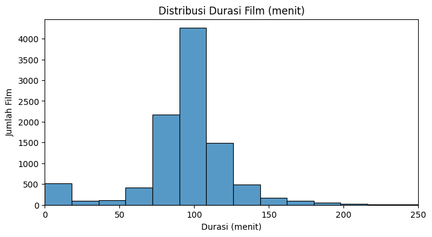

# **Project Overview**

Dengan terus bertambahnya jumlah film yang tersedia di berbagai platform digital, pengguna sering kesulitan menemukan film yang sesuai dengan selera mereka. Salah satu pendekatan populer untuk mengatasi permasalahan ini adalah sistem rekomendasi berbasis konten (*content-based filtering*), di mana rekomendasi diberikan berdasarkan kesamaan karakteristik konten — dalam hal ini, genre film.

Proyek ini bertujuan membangun **sistem rekomendasi film berdasarkan genre** menggunakan pendekatan content-based filtering. Misalnya, jika seorang pengguna menyukai film *King Kong*, maka sistem akan merekomendasikan film lain yang memiliki genre serupa seperti *Action*, *Adventure*, atau *Horror*.

Sistem ini relevan karena membantu pengguna mengeksplorasi film yang mungkin belum pernah mereka tonton namun memiliki karakteristik yang mereka sukai. Selain itu, pendekatan ini tidak memerlukan data interaksi pengguna lain, sehingga cocok untuk kondisi *cold start* atau sistem baru.

---

# **Business Understanding**

## **Problem Statements**

1. Bagaimana cara merepresentasikan informasi genre film secara numerik agar bisa digunakan dalam perhitungan kemiripan antar film?
2. Bagaimana cara mengukur tingkat kemiripan antar film hanya berdasarkan informasi kontennya, khususnya genre?
3. Bagaimana cara mengembangkan sistem rekomendasi film yang mampu memberikan saran film sejenis hanya dari satu input judul film?

## **Goals**

1. Menghasilkan sistem rekomendasi film yang mampu menyarankan film lain dengan genre yang mirip dari input satu judul film.
2. Memudahkan pengguna menemukan film-film baru sesuai dengan preferensi genre mereka tanpa perlu memberikan penilaian eksplisit.
3. Membuat sistem yang bersifat general dan bisa digunakan tanpa ketergantungan pada data pengguna (*user rating history*).

## **Solution Statements**

1. Menggunakan pendekatan content-based filtering dengan teknik TF-IDF vectorization untuk merepresentasikan genre film.
2. Mengukur kemiripan antar film menggunakan cosine similarity untuk menentukan film-film yang memiliki kemiripan konten.
3. Mengimplementasikan fungsi rekomendasi yang menerima judul film sebagai input dan menghasilkan daftar rekomendasi berdasarkan tingkat kemiripan genre.

---

# **Data Understanding**

**Link Dataset:**  
https://www.kaggle.com/api/v1/datasets/download/rounakbanik/the-movies-dataset

## **Dataset: Ratings**

```python
data_ratings = pd.read_csv("/content/ratings.csv")
data_ratings.info()
````
RangeIndex: 26024289 entries, 0 to 26024288

Data columns (total 4 columns):

| Kolom     | Deskripsi                                                           |
| --------- | ------------------------------------------------------------------- |
| userId    | ID pengguna yang memberikan rating.                                 |
| movieId   | ID film yang diberi rating.                                         |
| rating    | Nilai rating yang diberikan oleh pengguna (biasanya skala 1.0–5.0). |
| timestamp | Waktu pemberian rating dalam format Unix timestamp.                 |

**Insight:**

Data ratings memiliki 26.024.289 baris dan 4 fitur.

Karena data terlalu besar, hanya 10.000 data yang diambil:

```python
ratings = data_ratings.sample(n=10000, random_state=42)
ratings.shape
# Output: (10000, 4)
```

## **Dataset: Movies Metadata**

```python
data_movies = pd.read_csv("/content/movies_metadata.csv")
data_movies.info()
```

RangeIndex: 45466 entries, 0 to 45465

Data columns (total 24 columns):
| Kolom                   | Deskripsi                                     |
| ----------------------- | --------------------------------------------- |
| adult                   | Apakah film untuk dewasa (True/False).        |
| belongs\_to\_collection | Informasi jika film bagian dari seri/koleksi. |
| budget                  | Anggaran produksi film.                       |
| genres                  | Daftar genre film.                            |
| homepage                | URL resmi film (jika tersedia).               |
| id                      | ID unik film dari TMDB.                       |
| imdb\_id                | ID film di IMDb.                              |
| original\_language      | Bahasa asli film.                             |
| original\_title         | Judul asli film.                              |
| overview                | Sinopsis film.                                |
| popularity              | Skor popularitas dari TMDB.                   |
| poster\_path            | Path ke poster film.                          |
| production\_companies   | Perusahaan produksi film.                     |
| production\_countries   | Negara tempat film diproduksi.                |
| release\_date           | Tanggal rilis.                                |
| revenue                 | Pendapatan film.                              |
| runtime                 | Durasi film.                                  |
| spoken\_languages       | Bahasa yang digunakan dalam film.             |
| status                  | Status rilis film.                            |
| tagline                 | Slogan/tagline film.                          |
| title                   | Judul film (untuk ditampilkan).               |
| video                   | Apakah berupa video (True/False).             |
| vote\_average           | Rata-rata rating pengguna.                    |
| vote\_count             | Jumlah total suara/rating.                    |

**Insight:**

Data movies memiliki 45.466 baris dan 24 kolom.

Karena data terlalu besar, hanya 10.000 data yang diambil:

```python
movies = data_movies.sample(n=10000, random_state=42)
movies.shape
# Output: (10000, 24)
```

---

### **Deskripsi Statistik Ratings**

```python
ratings.describe()
```

| Kolom     | Insight                                                               |
| --------- | --------------------------------------------------------------------- |
| userId    | Rentang luas (8 – 270.761), variatif, artinya banyak user berbeda.    |
| movieId   | Rentang sangat luas, distribusi tidak merata (skewed).                |
| rating    | Rata-rata 3.53 (rentang 0.5 – 5), mayoritas rating cenderung positif. |
| timestamp | Rentang waktu luas, distribusi data pengambilan berlangsung lama.     |

---

### **Deskripsi Statistik Movies**

```python
movies.describe()
```

| Kolom         | Insight                                                                                                                                |
| ------------- | -------------------------------------------------------------------------------------------------------------------------------------- |
| revenue       | Rata-rata 10.7 juta, tapi sangat bervariasi. 75% film tidak mencatatkan revenue (nol), kemungkinan besar data tidak lengkap.           |
| runtime       | Rata-rata durasi 94 menit. Banyak film berdurasi antara 85–107 menit. Nilai ekstrim bisa jadi karena data tidak valid.                 |
| vote\_average | Rata-rata 5.61, mayoritas film mendapat rating 5–7. Nilai minimum 0 bisa berarti belum ada rating masuk.                               |
| vote\_count   | Rata-rata 107, tapi distribusi sangat skewed. Banyak film dengan vote sedikit, hanya sedikit film yang sangat populer (hingga 12.269). |

## **3. Exploratory Data Analysis**

### **a. Distribusi Rating**

<p align="center">
  
</p>

**Insight :**

1. **Sebaran Rating Tidak Merata (Right-skewed)**
   - Distribusi rating condong ke kanan, artinya lebih banyak film mendapatkan rating tinggi (3–5).
   - Hanya sedikit film yang mendapat rating rendah (kurang dari 2).

2. **Rating Populer di Skor 3 dan 4**
   - Puncak tertinggi histogram ada pada rating **3 dan 4**, menunjukkan banyak pengguna memberikan rating pada kisaran ini.

3. **Rating Sempurna (5) Juga Cukup Banyak**
   - Terjadi lonjakan lagi di rating **5**, mengindikasikan banyak film yang dinilai sangat bagus.

4. **Rating Ekstrem (0 - 1) Sangat Jarang**
   - Hampir tidak ada film yang mendapat rating mendekati 0, artinya sangat sedikit yang dianggap buruk sekali.

---

### **b. Distribusi Tahun Rilis Film**

<p align="center">
  
</p>

**Insight :**

1. **Jumlah Film Meningkat Signifikan Setelah Tahun 1980-an**
   - Pertumbuhan tajam terlihat mulai tahun 1980-an hingga puncak sekitar 2010–2015.

2. **Ledakan Produksi Film Era 2000-an**
   - Puncak produksi film terjadi di **2010–2015**, seiring munculnya studio independen dan platform streaming.

3. **Produksi Rendah di Awal Abad ke-20**
   - Produksi sangat sedikit sebelum 1950-an karena industri perfilman masih baru.

4. **Penurunan di Akhir Distribusi (sekitar 2020)**
   - Kemungkinan karena:
     - **Data belum lengkap**
     - **Pandemi COVID-19** yang menunda produksi film.

5. **Distribusi Positively Skewed (Kanan)**
   - Sebagian besar film berasal dari era modern.

---

### **c. Distribusi Runtime**

<p align="center">
  
</p>

**Insight :**

1. Film paling umum berdurasi 90–100 menit.

2. Ada sejumlah kecil film yang sangat pendek atau panjang, tapi tidak mendominasi.

3. Durasi 0 kemungkinan perlu diperlakukan sebagai data tidak valid dalam analisis lanjutan.

---

### **d. Rating Rata-Rata per Film**

<p align="center">
  
</p>

**Insight :**

1. **Distribusi Mendekati Normal**
   - Sebagian besar film memiliki rating rata-rata **2.5–4.0**.

2. **Pola "Bergelombang"**
   - Lonjakan di angka bulat seperti **3.0**, **4.0**, dan **5.0**.

3. **Rating Sangat Rendah Jarang**
   - Film dengan rating **1.0–2.0** sangat sedikit.

4. **Ada Film dengan Rating Mendekati 5.0**
   - Beberapa film sangat disukai (cult classic atau masterpiece).

5. **Skewness Tidak Terlalu Ekstrem**
   - Distribusi relatif simetris.

---

### **e. Korelasi Antar Fitur Numerik Film**

<p align="center">
  
</p>

**Insight :**

| Fitur 1        | Fitur 2          | Korelasi  | Interpretasi                                                                 |
| -------------- | ---------------- | --------- | ---------------------------------------------------------------------------- |
| `runtime`      | `release_year`   | **0.09**  | Korelasi sangat lemah, film modern sedikit lebih panjang, tapi tidak signifikan. |
| `runtime`      | `average_rating` | **-0.06** | Durasi film tidak berpengaruh signifikan terhadap rating.                   |
| `release_year` | `average_rating` | **0.02**  | Film lama dan baru punya peluang yang sama untuk disukai.                   |
| `rating_count` | `average_rating` | **0.04**  | Jumlah rating tidak berkaitan kuat dengan kualitas film.                    |
| `runtime`      | `rating_count`   | **0.02**  | Durasi tidak berkorelasi dengan banyaknya penonton.                         |

- Tidak ada korelasi linear kuat antar fitur numerik.
- Popularitas ≠ Kualitas.
- Durasi atau tahun rilis bukan penentu utama kesuksesan film.

---

### **f. Top 10 Movies Berdasarkan Popularity**

<p align="center">
  
</p>

**Insight :**

1. **Minions** adalah film paling populer dengan selisih sangat besar.
2. **Big Hero 6** berada di posisi ke-2, jauh di atas posisi ke-3 (Pulp Fiction).
3. **Genre bervariasi**:
   - Animasi dan keluarga: *Minions*, *Big Hero 6*
   - Aksi/superhero: *The Dark Knight*, *John Wick*
   - Drama/klasik: *Pulp Fiction*, *The Shawshank Redemption*
4. **Film Lama Tetap Populer**
   - Seperti *Pulp Fiction* dan *Shawshank Redemption*.

**Insight Tambahan**  
- **Popularitas ≠ Rating Tinggi**  
  Contoh: *Minions* populer tapi belum tentu punya rating tertinggi secara kritis.

---

## **4. Data Preparation**

### **a. Mengubah Dictionary menjadi String**

```
python
# Fungsi untuk memformat kolom 'genres' dari string menjadi format string genre yang dipisahkan tanda '|'
def format_genres(genre_string):
    # Tangani nilai NaN atau tipe data non-string
    if pd.isna(genre_string) or not isinstance(genre_string, str):
        return ""

    try:
        # Ubah string literal menjadi list of dict menggunakan ast.literal_eval
        parsed_genres = ast.literal_eval(genre_string)
    except (ValueError, SyntaxError) as e:
        # Jika parsing gagal, tampilkan peringatan dan kembalikan string kosong
        print(f"Warning: Tidak dapat parsing genre string '{genre_string}'. Error: {e}")
        return ""

    # Ambil nilai 'name' dari setiap dictionary dalam list dan gabungkan dengan delimiter '|'
    genre_names = [genre['name'] for genre in parsed_genres if 'name' in genre]
    return " | ".join(genre_names)

# Pilih kolom yang relevan dari DataFrame 'movies'
df = movies[['id', 'title']].copy()

# Terapkan fungsi format_genres ke kolom 'genres' dan simpan ke kolom baru
df['genres'] = movies['genres'].apply(format_genres)

# Susun ulang kolom dan ubah nama kolom 'id' menjadi 'movieId'
df = df[['id', 'title', 'genres']].rename(columns={'id': 'movieId'})

# Tampilkan 5 data teratas sebagai sampel
df.head()
````

**Insight :**
Data berhasil diubah dari format string kompleks menjadi format yang lebih sederhana dan mudah dipakai, dan disimpan dalam dataframe `df`.

---

### **b. Mengubah tipe data `movieId` menjadi string**

```python
df['movieId'] = df['movieId'].astype(str)
ratings['movieId'] = ratings['movieId'].astype(str)

df.info()
ratings.info()
```
```
<class 'pandas.core.frame.DataFrame'>
Index: 10000 entries, 43526 to 27147
Data columns (total 3 columns):
 #   Column   Non-Null Count  Dtype 
---  ------   --------------  ----- 
 0   movieId  10000 non-null  object
 1   title    9999 non-null   object
 2   genres   10000 non-null  object
dtypes: object(3)
memory usage: 312.5+ KB
<class 'pandas.core.frame.DataFrame'>
Index: 10000 entries, 11928665 to 13549562
Data columns (total 4 columns):
 #   Column     Non-Null Count  Dtype  
---  ------     --------------  -----  
 0   userId     10000 non-null  int64  
 1   movieId    10000 non-null  object 
 2   rating     10000 non-null  float64
 3   timestamp  10000 non-null  int64  
dtypes: float64(1), int64(2), object(1)
memory usage: 390.6+ KB
```

**Insight :**
Kolom `movieId` pada dataframe `df` dan `ratings` diubah menjadi string agar konsisten saat digabungkan.

---

### **c. Merge Data**

```python
movie_merged = pd.merge(ratings, df, on='movieId', how="inner")
movie_merged
```

```
	userId	movieId	rating	timestamp	title	genres
0	43059	1367	4.0	1088197740	Rocky II	Drama
1	255724	4975	1.0	1082336474	Love Is the Devil: Study for a Portrait of Fra...	TV Movie | Drama
2	246259	587	4.0	945228093	Big Fish	Adventure | Fantasy | Drama
3	72228	3022	3.5	1117138601	Dr. Jekyll and Mr. Hyde	Drama | Horror | Science Fiction
4	218871	5991	3.5	1287676841	The Last Laugh	Drama
...	...	...	...	...	...	...
987	116964	2734	3.0	1008741797	David	Drama | History
988	152250	69928	4.0	1339373959	The Man Who Loved Women	Comedy
989	118327	2108	4.0	1017621443	The Breakfast Club	Comedy | Drama
990	183641	919	4.0	1454248623	Blood: The Last Vampire	Fantasy | Animation | Horror | Comedy | Thrill...
991	135992	316	3.0	847883933	Grill Point	Comedy | Drama
992 rows × 6 columns
```

**Insight :**
Data berhasil di-merge berdasarkan kolom `movieId`, menghasilkan 992 baris dan 6 kolom: `userId`, `movieId`, `rating`, `timestamp`, `title`, dan `genres`.

---

### **d. Handle Missing Values**

```python
movie_merged.isnull().sum()
```

| Kolom      | Jumlah Null |
|------------|-------------|
| userId     | 0           |
| movieId    | 0           |
| rating     | 0           |
| timestamp  | 0           |
| title      | 0           |
| genres     | 0           |

**Insight :**
Tidak terdapat missing values dalam data `movie_merged`.

---

### **e. Handle Duplicated Data**

```python
movie_merged.duplicated().sum()
```
```
Output :
np.int64(0)
```
**Insight :**
Tidak terdapat data duplikat dalam `movie_merged`.

---

### f. Menangani Outlier dengan IQR Method
```
# Mengganti Nilai Outlier dengan Batas Atas dan Batas Bawah Data

for i in movie_merged.select_dtypes(include='number'):
    Q1 = movie_merged[i].quantile(0.25)
    Q3 = movie_merged[i].quantile(0.75)
    IQR = Q3 - Q1

    maximum = Q3 + (1.5 * IQR)
    minimum = Q1 - (1.5 * IQR)

    movie_merged[i] = movie_merged[i].mask(movie_merged[i] > maximum, maximum)
    movie_merged[i] = movie_merged[i].mask(movie_merged[i] < minimum, minimum)
```

<p align="center">
  
</p>

**Insight :**

| Fitur         | Insight                                                                                                                                                              |
| ------------- | -------------------------------------------------------------------------------------------------------------------------------------------------------------------- |
| **userId**    | Distribusi user cukup merata tanpa outlier. Semua nilai userId berada dalam rentang wajar (0–270k). Tidak ada titik ekstrem.                                         |
| **rating**    | Rentang rating hanya dari 0.5 hingga 5, dan sudah **tidak ada outlier**. Distribusi simetris dengan median sekitar 3.5. Artinya sistem rating berjalan sesuai skala. |
| **timestamp** | Distribusi waktu rating (dalam format Unix timestamp) juga sudah **tanpa outlier**. Data berkisar dari sekitar 2007 hingga 2017.                                     |

**Kesimpulan :**

* Penanganan outlier berhasil — tidak ada lagi nilai ekstrem atau titik individu terisolasi pada semua fitur numerik.
* Data siap digunakan untuk analisis atau modeling lebih lanjut karena sudah bersih dan stabil.

---

### **g. Memecah Genres yang Dipisahkan oleh `|`**

```python
genres = set()
for genres_str in movie_merged['genres']:
    if genres_str:  # Only process non-empty strings
        for genre in genres_str.split(' | '):
            genres.add(genre.strip())

genres_list = list(genres)
print(genres_list)
```

**Insight :**
Kode ini mengekstrak semua genre unik dari kolom `genres` pada `movie_merged`, memisahkan dengan delimiter `|`, dan menyimpannya dalam list tanpa duplikat. Hasil akhirnya adalah daftar genre unik yang bisa digunakan untuk analisis lanjutan.

---

## **Model Development: Content-Based Filtering menggunakan TF-IDF Vectorizer**

### 1. **Inisialisasi TF-IDF Vectorizer**

Langkah pertama adalah mengubah teks pada kolom `genres` menjadi representasi numerik menggunakan **TF-IDF (Term Frequency - Inverse Document Frequency)**. Proses ini bertujuan untuk mengetahui seberapa penting suatu genre (seperti *action*, *drama*, *comedy*, dll.) dalam keseluruhan kumpulan data film:

```python
from sklearn.feature_extraction.text import TfidfVectorizer

# Inisialisasi TF-IDF
tfidf = TfidfVectorizer()

# Fit dan transform kolom genres menjadi matriks TF-IDF
tfidf_matrix = tfidf.fit_transform(movie_merged['genres'])

# Melihat ukuran matrix tfidf
tfidf_matrix.shape
```
> (992, 22)

```
# Mengubah vektor tf-idf dalam bentuk matriks dengan fungsi todense()
tfidf_matrix.todense()
```

```
matrix([[0.        , 0.        , 0.        , ..., 0.        , 0.        ,
         0.        ],
        [0.        , 0.        , 0.        , ..., 0.69140498, 0.        ,
         0.        ],
        [0.        , 0.59553039, 0.        , ..., 0.        , 0.        ,
         0.        ],
        ...,
        [0.        , 0.        , 0.        , ..., 0.        , 0.        ,
         0.        ],
        [0.        , 0.        , 0.52798862, ..., 0.        , 0.        ,
         0.        ],
        [0.        , 0.        , 0.        , ..., 0.        , 0.        ,
         0.        ]])
```

> **Insight:**
> TF-IDF berhasil mengubah data genre dari 992 film menjadi matriks berukuran 992 × 22, di mana setiap baris mewakili satu film dan setiap kolom mewakili bobot penting genre tertentu. Ini memungkinkan analisis numerik berbasis teks yang lebih akurat.

---

### 2. **Membangun Matriks Similarity dengan Cosine Similarity**

Selanjutnya, digunakan **cosine similarity** untuk menghitung tingkat kemiripan antar film berdasarkan representasi TF-IDF genre mereka:

```python
from sklearn.metrics.pairwise import cosine_similarity

# Menghitung kemiripan antar film
cosine_sim = cosine_similarity(tfidf_matrix)

# Mengubah ke DataFrame untuk memudahkan interpretasi
cosine_sim_df = pd.DataFrame(cosine_sim, index=movie_merged['title'], columns=movie_merged['title'])
```

> **Insight:**
> Nilai cosine similarity mendekati 1 menunjukkan film yang sangat mirip berdasarkan genre, sedangkan nilai mendekati 0 menunjukkan film yang tidak mirip. Matriks ini menjadi dasar dalam sistem rekomendasi film berbasis genre.

---

### 3. **Fungsi Rekomendasi Film**

Fungsi berikut dibuat untuk menghasilkan rekomendasi film berdasarkan judul film yang dimasukkan:

```python
def movie_recommendations(title, similarity=cosine_sim_df, items=movie_merged[['title', 'genres']], k=5):
    index = similarity.loc[:, title].to_numpy().argpartition(range(-1, -k, -1)).flatten()
    most_similiar = similarity.columns[index[-1:-(k+2):-1]]
    most_similiar = most_similiar.drop(title, errors='ignore')
    return pd.DataFrame(most_similiar).merge(items).head(k)
```

Contoh penggunaan:

```python
movie_recommendations("Man's Favorite Sport?")
```

**Output Rekomendasi:**

| title                                    | genres                          |
| ---------------------------------------- | ------------------------------- |
| The Man in the Iron Mask                 | Romance \| Drama                |
| The 400 Blows                            | Drama                           |
| Harry Potter and the Prisoner of Azkaban | Adventure \| Fantasy \| Family  |
| Live and Let Die                         | Adventure \| Action \| Thriller |
| House of Dracula                         | Horror \| Science Fiction       |

> **Insight:**
> Sistem rekomendasi berhasil memberikan daftar film yang memiliki genre serupa dengan film input, dalam hal ini *Man's Favorite Sport?*. Hal ini menunjukkan bahwa genre dapat menjadi indikator kuat dalam menentukan kemiripan konten antar film.

# **Problem Answers**

---

## **1. Bagaimana cara merepresentasikan informasi genre film secara numerik agar bisa digunakan dalam perhitungan kemiripan antar film?**

```python
# Cek apakah TF-IDF berhasil transform genre jadi matriks numerik
try:
    # tf sudah TfidfVectorizer dari kode kamu
    tfidf_matrix = tfidf.fit_transform(movie_merged['genres'])
    print("TF-IDF matrix shape:", tfidf_matrix.shape)
    assert tfidf_matrix.shape[0] == movie_merged.shape[0], "Jumlah baris TF-IDF harus sama dengan jumlah film"
    print("Representasi genre ke numerik berhasil.")
except Exception as e:
    print("Error pada representasi genre:", e)
````

**Hasil Output:**

```
TF-IDF matrix shape: (992, 22)
Representasi genre ke numerik berhasil.
```

**Insight :**

TF-IDF berhasil mengubah genre film menjadi vektor numerik berdimensi **(992, 22)**, artinya **992 film** direpresentasikan oleh **22 genre unik**. Representasi ini memungkinkan perhitungan kemiripan antar film berdasarkan bobot genre, dan jadi dasar utama untuk sistem rekomendasi content-based filtering.

---

## **2. Bagaimana cara mengukur tingkat kemiripan antar film hanya berdasarkan informasi kontennya, khususnya genre?**

```python
# Tentukan dua judul film yang ingin dibandingkan
movie_1 = 'Men in Black II'
movie_2 = 'Jurassic Park'

# Ambil nilai similarity antara dua film tersebut
similarity_score = cosine_sim_df.loc[movie_1, movie_2]

# Konversi ke float kalau hasilnya satu sel DataFrame
if isinstance(similarity_score, pd.DataFrame):
    similarity_score = similarity_score.values[0][0]
elif isinstance(similarity_score, pd.Series):
    similarity_score = similarity_score.values[0]

print(f"Similarity antara '{movie_1}' dan '{movie_2}': {similarity_score:.4f}")
```

**Hasil Output:**

```
Similarity antara 'Men in Black II' dan 'Jurassic Park': 0.8289
```

**Insight :**

Dengan menghitung **cosine similarity** dari representasi TF-IDF genre, kita bisa mengukur seberapa mirip dua film berdasarkan kontennya. Nilai similarity **0.8289** menunjukkan bahwa *Men in Black II* dan *Jurassic Park* memiliki genre yang sangat mirip, seperti action, adventure, atau sci-fi. Ini jadi dasar sistem rekomendasi berbasis konten.

---

## **3. Bagaimana cara mengembangkan sistem rekomendasi film yang mampu memberikan saran film sejenis hanya dari satu input judul film?**

```python
# Fungsi inputan dan rekomendasi film
def test_movie_recommendation():
    title_input = input("Masukkan judul film yang ingin direkomendasikan film miripnya: ")
    try:
        recommendations = movie_recommendations(title_input, k=5)
        print(f"\nRekomendasi film mirip dengan '{title_input}':\n")
        print(recommendations[['title', 'genres']])
    except KeyError:
        print(f"Judul film '{title_input}' tidak ditemukan dalam data.")

# Jalankan fungsi uji rekomendasi dengan inputan
test_movie_recommendation()
```

**Contoh Input:**

```
Masukkan judul film yang ingin direkomendasikan film miripnya: Armageddon
```

**Hasil Output:**

```
Rekomendasi film mirip dengan 'Armageddon':

                     title                            genres
0              Grill Point                    Comedy | Drama
1             Tough Enough                  Drama | Thriller
2           The Last Laugh                             Drama
3  Dr. Jekyll and Mr. Hyde  Drama | Horror | Science Fiction
4                 Big Fish       Adventure | Fantasy | Drama
```

**Insight :**

Model berhasil memberikan rekomendasi film berdasarkan kemiripan genre.

Film seperti Grill Point, Tough Enough, dan Big Fish direkomendasikan karena memiliki genre yang serupa, seperti Drama, Adventure, atau Thriller, sesuai dengan pendekatan content-based filtering. Ini menunjukkan bahwa sistem dapat menemukan film sejenis hanya dari input satu judul film.

---

## **Referensi**

* Adomavicius, G., & Tuzhilin, A. (2005). Toward the next generation of recommender systems: A survey of the state-of-the-art and possible extensions. *IEEE Transactions on Knowledge and Data Engineering, 17(6), 734–749*. [https://doi.org/10.1109/TKDE.2005.99](https://doi.org/10.1109/TKDE.2005.99)

* Lops, P., De Gemmis, M., & Semeraro, G. (2011). Content-based recommender systems: State of the art and trends. In *Recommender Systems Handbook* (pp. 73–105). Springer. [https://doi.org/10.1007/978-0-387-85820-3\_3](https://doi.org/10.1007/978-0-387-85820-3_3)

* Ricci, F., Rokach, L., & Shapira, B. (2011). Introduction to recommender systems handbook. In *Recommender Systems Handbook* (pp. 1–35). Springer. [https://doi.org/10.1007/978-0-387-85820-3\_1](https://doi.org/10.1007/978-0-387-85820-3_1)

* Aggarwal, C. C. (2016). Content-based recommender systems. In *Recommender Systems: The Textbook* (pp. 139–166). Springer. [https://doi.org/10.1007/978-3-319-29659-3\_5](https://doi.org/10.1007/978-3-319-29659-3_5)

* Banik, R. (2017). *The Movies Dataset*. Kaggle. [https://www.kaggle.com/datasets/rounakbanik/the-movies-dataset](https://www.kaggle.com/datasets/rounakbanik/the-movies-dataset)


